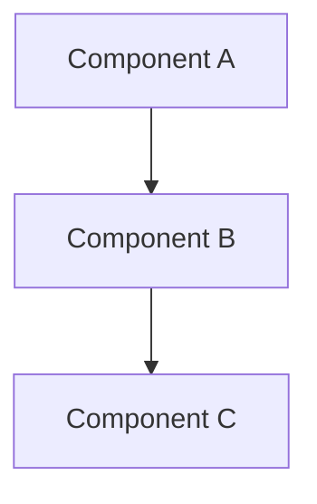

## Epic Overview
**Epic ID**: E-XXX
**Priority**: [Highest/High/Medium/Low]
**Estimated Duration**: X weeks
**Target Sprint**: Sprint X

## Business Value
**Problem Statement**:
Describe the problem this epic solves.

**Success Metrics**:
- [ ] Metric 1: Target value
- [ ] Metric 2: Target value
- [ ] Metric 3: Target value

**User Impact**:
- Who benefits from this epic
- How it improves their workflow
- Expected adoption rate

## Epic Scope

### Included Features
- [ ] Feature 1 (Story S-XXX)
- [ ] Feature 2 (Story S-XXX)
- [ ] Feature 3 (Story S-XXX)

### Out of Scope
- Feature A (deferred to future epic)
- Feature B (not required for MVP)

### Dependencies
- [ ] Epic E-XXX: Dependency description
- [ ] External dependency: Description
- [ ] Technical prerequisite: Description

## User Stories
Link to related user stories and their status:

### Core Stories (Must Have)
- [ ] [S-XXX: Story Name](link-to-story) - Status
- [ ] [S-XXX: Story Name](link-to-story) - Status

### Enhanced Stories (Should Have)
- [ ] [S-XXX: Story Name](link-to-story) - Status
- [ ] [S-XXX: Story Name](link-to-story) - Status

### Optional Stories (Could Have)
- [ ] [S-XXX: Story Name](link-to-story) - Status

## Technical Architecture

### System Components

### Technology Stack
- **Backend**: Technologies and frameworks
- **Frontend**: Technologies and frameworks
- **Database**: Schema and data requirements
- **Infrastructure**: Deployment and operations

### Integration Points
- [ ] External API: Description
- [ ] Internal service: Description
- [ ] Third-party tool: Description

## Implementation Plan

### Phase 1: Foundation (Week 1-2)
**Goal**: Core infrastructure and basic functionality
- [ ] Task 1: Description
- [ ] Task 2: Description

### Phase 2: Core Features (Week 3-4)
**Goal**: Primary user functionality
- [ ] Task 1: Description
- [ ] Task 2: Description

### Phase 3: Enhancement (Week 5-6)
**Goal**: Advanced features and optimization
- [ ] Task 1: Description
- [ ] Task 2: Description

## Risk Assessment

### High Risk Items
- **Risk**: Description
  - **Impact**: High/Medium/Low
  - **Probability**: High/Medium/Low
  - **Mitigation**: Mitigation strategy

### Medium Risk Items
- **Risk**: Description
  - **Mitigation**: Mitigation strategy

## Definition of Done

### Functional Requirements
- [ ] All user stories completed and tested
- [ ] Integration testing passed
- [ ] Performance requirements met
- [ ] Security requirements implemented

### Quality Requirements
- [ ] Code coverage > 95%
- [ ] Security audit completed
- [ ] Load testing passed
- [ ] Documentation complete

### Operational Requirements
- [ ] Deployment pipeline operational
- [ ] Monitoring and alerting configured
- [ ] Team training completed
- [ ] Runbooks and procedures documented

## Success Criteria
- [ ] Business metrics achieved
- [ ] User acceptance testing passed
- [ ] Performance targets met
- [ ] No critical bugs in production
- [ ] Team and stakeholder satisfaction

---
**Epic Planning**:
- Epic Document: `planning/epics/E-XXX-epic-name.md`
- Related Stories: `planning/stories/S-XXX-*.md`
- Project Board: [Link to GitHub Project]