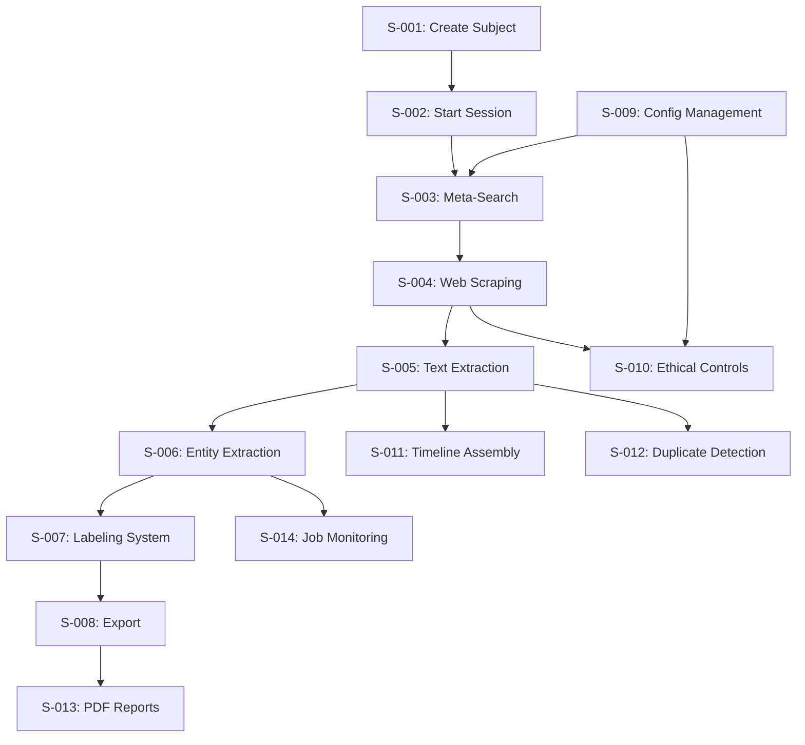

# OSINT Platform Backlog

## MVP Stories (Priority: High) 🔥

### Foundation Infrastructure
- **S-001**: [Create Subject](stories/S-001-create-subject.md) — Priority: High — Estimate: 2d
  Links: [Story](stories/S-001-create-subject.md) · [Design](../docs/design/osint-platform.md) · [Tasks](tasks/T-001-create-subject.md)

- **S-002**: [Start Investigation Session](stories/S-002-start-session.md) — Priority: High — Estimate: 2d
  Links: [Story](stories/S-002-start-session.md) · [Design](../docs/design/osint-platform.md) · [Tasks](tasks/T-002-start-session.md)

- **S-009**: [Configuration Management](stories/S-009-config-management.md) — Priority: High — Estimate: 3d
  Links: [Story](stories/S-009-config-management.md) · [Design](../docs/design/osint-platform.md) · [Tasks](tasks/T-009-config-management.md)

### Data Collection Engine
- **S-003**: [Meta-Search Implementation](stories/S-003-meta-search.md) — Priority: High — Estimate: 3d
  Links: [Story](stories/S-003-meta-search.md) · [Design](../docs/design/osint-platform.md) · [Tasks](tasks/T-003-meta-search.md)

- **S-004**: [Playwright Web Scraping](stories/S-004-web-scraping.md) — Priority: High — Estimate: 4d
  Links: [Story](stories/S-004-web-scraping.md) · [Design](../docs/design/osint-platform.md) · [Tasks](tasks/T-004-web-scraping.md)

- **S-010**: [Ethical Scraping Controls](stories/S-010-ethical-controls.md) — Priority: High — Estimate: 3d
  Links: [Story](stories/S-010-ethical-controls.md) · [Design](../docs/design/osint-platform.md) · [Tasks](tasks/T-010-ethical-controls.md)

### Content Processing Pipeline
- **S-005**: [Text Extraction & Language Detection](stories/S-005-text-extraction.md) — Priority: High — Estimate: 2d
  Links: [Story](stories/S-005-text-extraction.md) · [Design](../docs/design/osint-platform.md) · [Tasks](tasks/T-005-text-extraction.md)

- **S-006**: [AI Entity Extraction](stories/S-006-entity-extraction.md) — Priority: High — Estimate: 4d
  Links: [Story](stories/S-006-entity-extraction.md) · [Design](../docs/design/osint-platform.md) · [Tasks](tasks/T-006-entity-extraction.md)

- **S-007**: [Labeling & Filtering System](stories/S-007-labeling-system.md) — Priority: High — Estimate: 3d
  Links: [Story](stories/S-007-labeling-system.md) · [Design](../docs/design/osint-platform.md) · [Tasks](tasks/T-007-labeling-system.md)

- **S-008**: [Export Functionality](stories/S-008-export-functionality.md) — Priority: High — Estimate: 2d
  Links: [Story](stories/S-008-export-functionality.md) · [Design](../docs/design/osint-platform.md) · [Tasks](tasks/T-008-export-functionality.md)

## Enhanced Features (Priority: Medium) 📈

### Advanced Analysis
- **S-011**: [Timeline Assembly](stories/S-011-timeline-assembly.md) — Priority: Medium — Estimate: 3d
  Links: [Story](stories/S-011-timeline-assembly.md) · [Design](../docs/design/osint-platform.md) · [Tasks](tasks/T-011-timeline-assembly.md)

- **S-012**: [Duplicate Detection](stories/S-012-duplicate-detection.md) — Priority: Medium — Estimate: 3d
  Links: [Story](stories/S-012-duplicate-detection.md) · [Design](../docs/design/osint-platform.md) · [Tasks](tasks/T-012-duplicate-detection.md)

- **S-013**: [PDF Report Generation](stories/S-013-pdf-reports.md) — Priority: Medium — Estimate: 3d
  Links: [Story](stories/S-013-pdf-reports.md) · [Design](../docs/design/osint-platform.md) · [Tasks](tasks/T-013-pdf-reports.md)

### Operational Excellence
- **S-014**: [Job Monitoring](stories/S-014-job-monitoring.md) — Priority: Medium — Estimate: 2d
  Links: [Story](stories/S-014-job-monitoring.md) · [Design](../docs/design/osint-platform.md) · [Tasks](tasks/T-014-job-monitoring.md)

## Future Backlog (Priority: Low) 🔮

### Advanced Data Sources
- **S-015**: Social Media Integration — Priority: Low — Estimate: 5d
- **S-016**: IoT Device Discovery — Priority: Low — Estimate: 4d
- **S-017**: Threat Intelligence Feeds — Priority: Low — Estimate: 3d

### Collaboration Features
- **S-018**: Multi-User Workspaces — Priority: Low — Estimate: 5d
- **S-019**: Real-Time Collaboration — Priority: Low — Estimate: 4d
- **S-020**: Role-Based Access Control — Priority: Low — Estimate: 3d

### Advanced Analytics
- **S-021**: Network Analysis & Relationship Mapping — Priority: Low — Estimate: 5d
- **S-022**: Sentiment Analysis — Priority: Low — Estimate: 3d
- **S-023**: Pattern Recognition & Anomaly Detection — Priority: Low — Estimate: 4d

## Story Dependencies

## Current Sprint Planning

### Sprint 1 (Week 1-2): Foundation
**Goal**: Core infrastructure and subject management
- S-001: Create Subject ✅
- S-002: Start Session
- S-009: Config Management

### Sprint 2 (Week 3-4): Data Collection
**Goal**: Search and scraping capabilities
- S-003: Meta-Search
- S-004: Web Scraping
- S-010: Ethical Controls

### Sprint 3 (Week 5-6): Content Processing
**Goal**: Text processing and AI analysis
- S-005: Text Extraction
- S-006: Entity Extraction
- S-007: Labeling System
- S-008: Export Functionality

## Backlog Grooming Notes

### Ready for Development
Stories marked with ✅ have:
- Complete acceptance criteria
- Linked design documentation
- Defined test plans
- Task breakdowns created
- Dependencies identified

### Needs Refinement
Stories requiring more detail:
- All future backlog items (S-015+)
- Some medium priority features need technical research

### Blocked Items
Currently no blocked stories. Potential blockers:
- AI model selection for entity extraction
- Search engine API rate limits
- Legal review for scraping policies